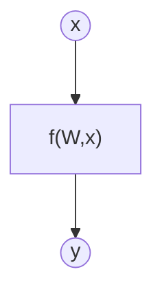
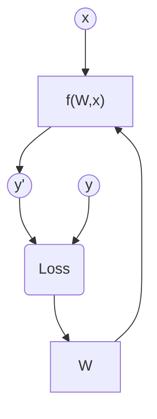
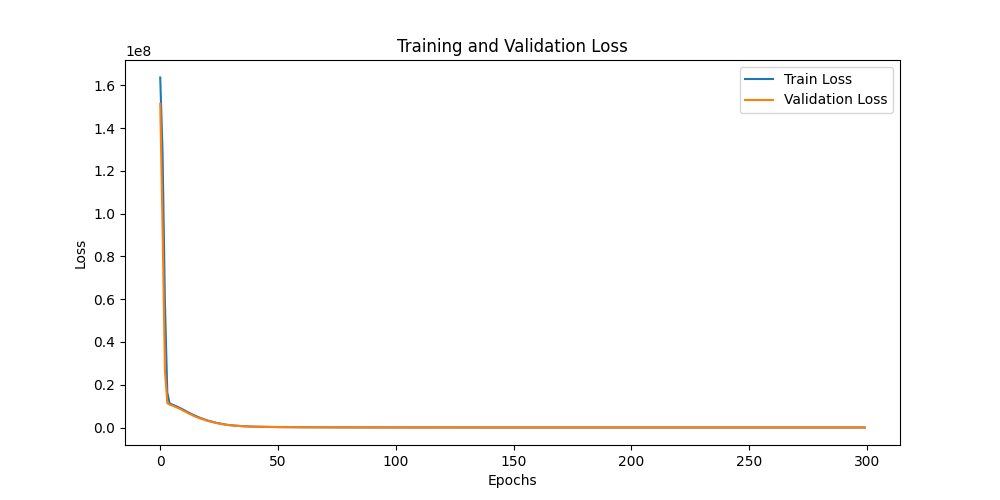
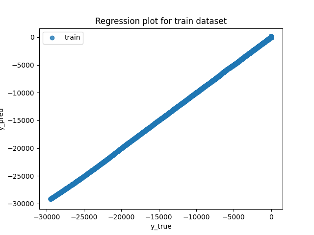
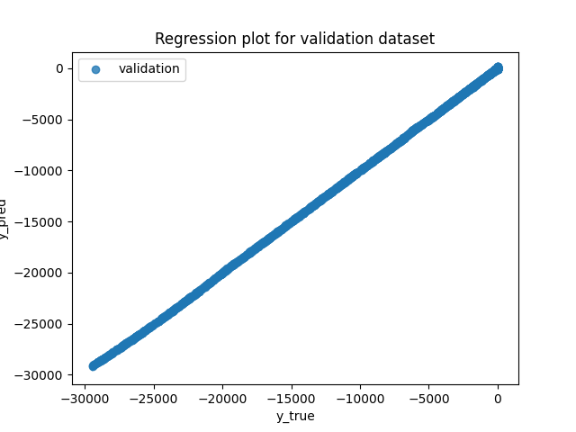
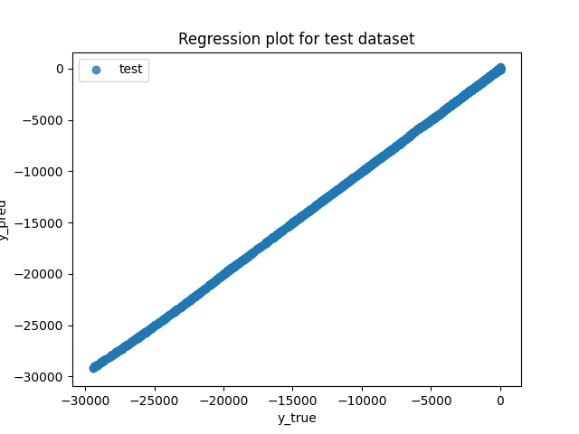
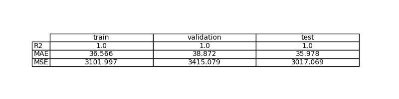
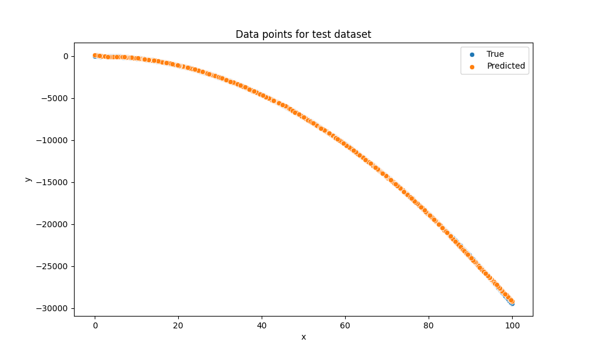

# Exercise 2: Learn a linear function with PyTorch

## Objective

El objetivo de este ejercicio es estimar una función desconocida a partir de datos observados mediante un modelo de machine learning.

La función que se pretende modelar es una función no lineal de segundo grado 

$y = -3x^2 + 5x + ruido$

El objetivo del ejercicio no es descubrir explícitamente la expresión analítica de la función, sino entrenar un modelo que sea capaz de reproducir su comportamiento a partir de datos, incluso si el modelo actúa como una caja negra.

## Task Formalization

La tarea que se aborda en este ejercicio puede formalizarse en dos etapas. En primer lugar, se define el objetivo del problema. En segundo lugar, se describe el enfoque utilizado para resolverlo mediante entrenamiento supervisado.

### Task Formalization (Inference)

Existe una función desconocida $f$ de la cual se dispone de un conjunto de datos que relacionan valores de entrada $𝑥$ con valores de salida $y$.

$$
y = f(x)
$$

El objetivo es construir un modelo de aprendizaje automático que aproxime dicha función a partir de los datos disponibles. El modelo aprende un conjunto de parámetros $W$ que permiten expresar la relación entre la entrada y la salida:

$$
y = f(W,x)
$$

Desde el punto de vista gráfico, el proceso de inferencia puede representarse como:

### Task Formalization (Training)

Durante el entrenamiento, el modelo recibe pares de datos 
$(x,y)$. A partir de la entrada $x$, el modelo produce una predicción $y$, que se compara con el valor real $y$ mediante una función de pérdida. Esta pérdida se utiliza para actualizar los parámetros del modelo mediante backpropagation del error y optimización basada en gradiente descendente.

El proceso puede representarse gráficamente de la siguiente manera:

## Evaluation metrics

Dado que se trata de un problema de regresión, se utilizan las siguientes métricas de evaluación:

Mean Squared Error ($MSE$): mide el error cuadrático medio.

Mean Absolute Error ($MAE$): mide el error absoluto medio.

R-squared ($R^2$): indica la proporción de varianza explicada por el modelo.

Estas métricas permiten evaluar tanto la precisión como la capacidad de generalización del modelo.
## Data Considerations

### Dataset description

El dataset es sintético y está compuesto por 10.000 puntos generados a partir de una función cuadrática no lineal. Los valores de entrada $x$ se generan de forma uniforme en el rango [0,100]. La salida $y$ se obtiene aplicando la función real y añadiendo ruido gaussiano con desviación estándar fija para simular datos reales.

### Data preparation and preprocessing

Los datos se convierten a tensores de PyTorch y se reestructuran para cumplir con el formato requerido por el modelo. Posteriormente, el dataset se divide en tres subconjuntos independientes:

70% para entrenamiento

15% para validación

15% para test

### Data augmentation

No se realiza aumento de datos, ya que el dataset es suficientemente grande para el objetivo del ejercicio.

## Model Considerations

El modelo utilizado es una red neuronal multicapa (MLP), diseñada para capturar relaciones no lineales entre la entrada y la salida.

La arquitectura de la red neuronal es:

Una capa de entrada de dimensión 1

Dos capas ocultas con 64 neuronas cada una

Una capa de salida de dimensión 1

### Suitable Loss Functions

Para problemas de regresión, las funciones de pérdida más habituales son $MSE$ y $MAE$.

### Selected Loss Function

Se utiliza la función de pérdida Mean Squared Error (MSE), ya que es adecuada para problemas de regresión continua y penaliza fuertemente los errores grandes.

### Possible architectures

Inicialmente podría plantearse una regresión lineal simple; sin embargo, este tipo de modelo no es capaz de aproximar una función cuadrática. Por este motivo, se utiliza una red neuronal multicapa con capas ocultas y funciones de activación no lineales, lo que permite al modelo aproximar funciones complejas.

Las principales ventajas del MLP son su capacidad de aproximación universal y su flexibilidad. Como desventaja, requiere un mayor número de hiperparámetros y un proceso de entrenamiento más cuidadoso.

### Last layer activation

Como se trata de un problema de regresión sin límites superiores ni inferiores en la salida, la última capa utiliza una función de activación identidad (sin activación).

### Other Considerations

El uso de funciones de activación ReLU en las capas ocultas permite introducir no linealidad y evita problemas de saturación del gradiente, mejorando la estabilidad del entrenamiento.

## Training

El entrenamiento del modelo se realiza durante 300 épocas. Se utiliza validación para monitorizar el rendimiento y seleccionar el mejor modelo según la pérdida de validación. Es decir, se guarda el modelo con el que se consiguen las mejores respuestas de validación (best model).

### Training hyperparameters

Estos son los hiperparámetros que hemos elegido para el entrenamiento del modelo. Porque con estos parámetros hemos conseguido los valores que proporcionan el mejor equilibrio entre estabilidad y velocidad de convergencia.

Optimizer: AdamW

Learning rate: 0.001

Batch size: 64

Number of epochs: 300

### Loss function graph

En el gráfico se puede observar claramente como disminuye el error de train y validation. También se observa que no hay overfitting ya que el loss de validation sigue bajando y no sube (lo que sería un indicador de overfitting).

### Discussion of the training process

Durante el entrenamiento se observa una disminución progresiva de la pérdida tanto en el conjunto de entrenamiento como en el de validación. Esto indica una correcta convergencia del modelo sin evidencias de sobreajuste, como se ha mencionado antes.

## Evaluation

### Evaluation metrics

Las métricas $MSE$, $MAE$ y $R^2$ se calculan para los conjuntos de entrenamiento, validación y test. Las gráficas de regresión muestran una buena correspondencia entre los valores reales y los valores predichos.

Las métricas obtenidas para cada conjunto se resumen en la siguiente figura:

### Evaluation results

Las gráficas de puntos muestran que el modelo es capaz de aproximar correctamente la forma de la función cuadrática tanto en entrenamiento como en validación y test.

Example for train set:

Example for validation set:

Example for test set:

### Discussion of the results

El modelo resuelve el problema aprendiendo una representación no lineal de la relación entre $x$ e $y$.

El modelo no tiene underfitting, ya que el captura correctamente la curvatura de la función. Tampoco se aprecian signos de overfitting, dado que las métricas en test son muy similares a las de entrenamiento.

Gracias a la regularidad del problema y al ruido gaussiano controlado, el modelo debería generalizar correctamente a nuevos datos dentro del mismo rango de entrada.

## Design Feedback loops

Primero lo intentamos con un modelo de simple perceptrón que está formado por una capa lineal sin capas ocultas ni funciones de activación no lienale. Este modelo solo puede aprender relacione slineales, por lo que no era capaz de aprender la curvatura de los tatos, por lo que salían muy malos resultados, el modelo ajustaba una recta en vez de una curva y no predecia bien por ello.

Por ello creamos un diseño multipaca con capas ocultas y funciones de activación no lineales. La arquitectura elegida es la siguiente: una capa de entrada de dimensión 1, dos capas ocultas de 64 neuronas cada una, una capa de salida de dimensión 1 y entre las capas ocultas una función de activación ReLu para introducir no linealidad al modelo.

Por último elegimos lo hiperparámetros que mejor resultados nos daban. Establecimos un número de 300 épocas para que el modelo convergiera adecuadamente. Pusimos un batch size de 64 porque daba un buen equilibrio entre ruido y generalizar. Y por último elegimos un learning rate de 0.001 dandonos un buen equilibrio entre oscilaciones y lentitud.

## Questions

Pleaser answer the following questions. Include graphs if necessary. Store the graphs in the `outs/exercise_02` folder.

### Which are the differences you found between previous model and this one?

El modelo anterior era lineal y no podía aproximar una función cuadrática. El nuevo modelo introduce capas ocultas y funciones de activación no lineales, permitiendo aprender relaciones complejas.

### Does the model generalizes well to new data?

Sí, el modelo generaliza correctamente a nuevos datos dentro del rango de entrenamiento, como se observa en las métricas y en las gráficas del conjunto de test.