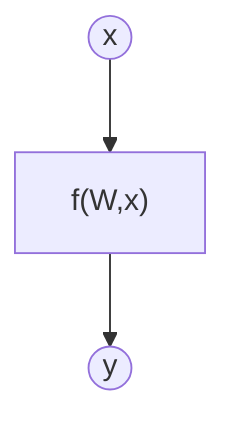
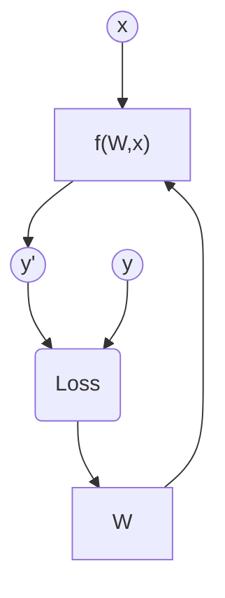
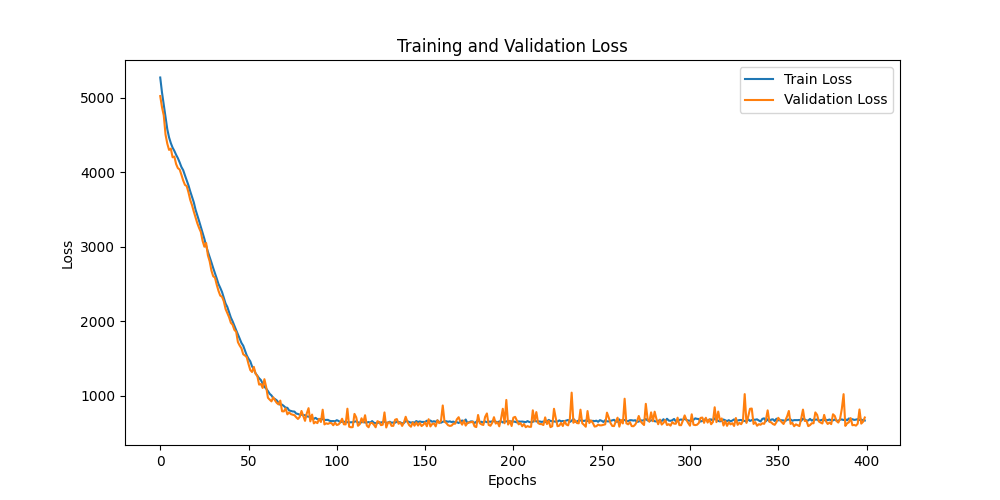
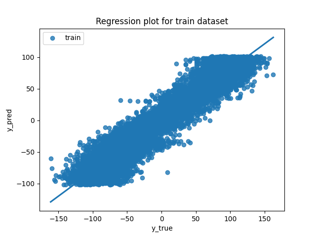
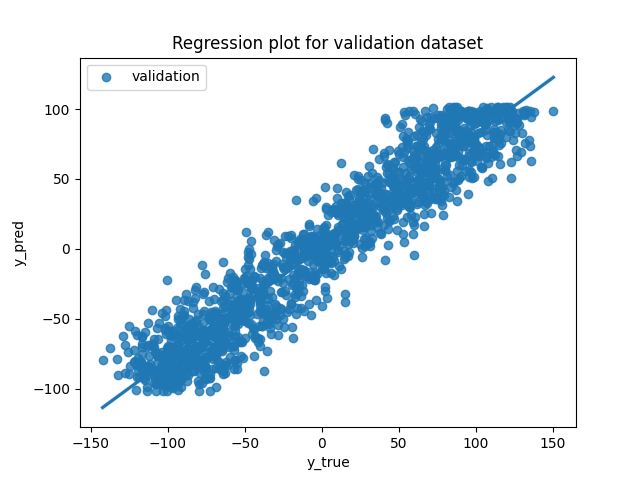
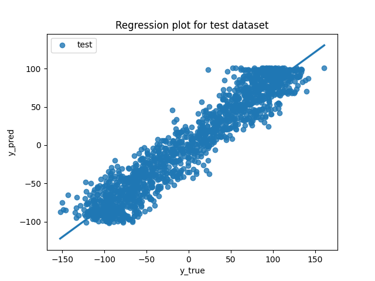
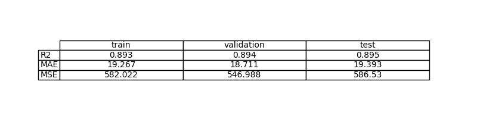
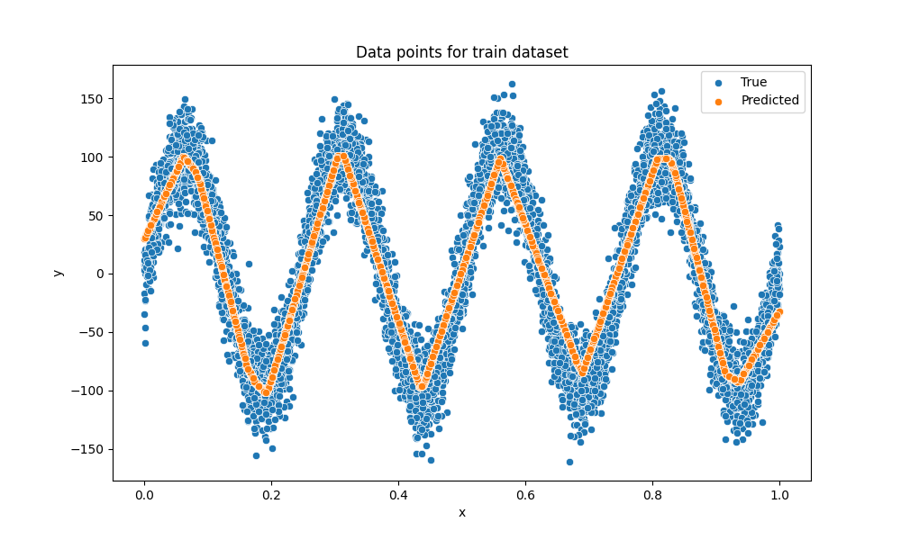
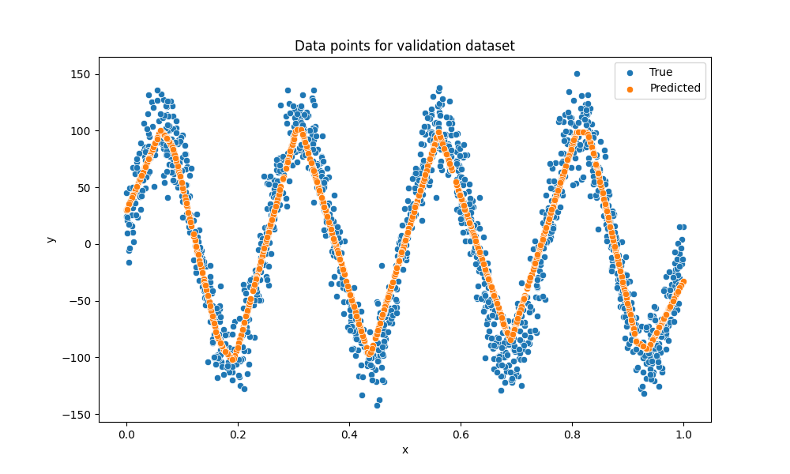
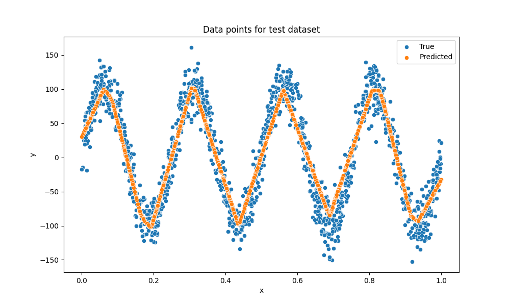

# Exercise 3: Learn a non-linear function with PyTorch

## Objective

El objetivo de este ejercicio es estimar una función desconocida a partir de datos observados mediante un modelo de machine learning.

La función que se pretende modelar es una función no lineal sinusoidal
$$
 y = 100 \sin\left(\frac{8\pi x}{100}\right) + 2
$$ 
 
 El objetivo del ejercicio no es descubrir explícitamente la expresión analítica de la función, sino entrenar un modelo que sea capaz de reproducir su comportamiento a partir de datos, incluso si el modelo actúa como una caja negra.

## Task Formalization

La tarea que se aborda en este ejercicio puede formalizarse en dos etapas. En primer lugar, se define el objetivo del problema. En segundo lugar, se describe el enfoque utilizado para resolverlo mediante entrenamiento supervisado.

### Task Formalization (Inference)

Existe una función desconocida $f$ de la cual se dispone de un conjunto de datos que relacionan valores de entrada $𝑥$ con valores de salida $y$.

$$
y = f(x)
$$

El objetivo es construir un modelo de Machine Learning que aproxime dicha función a partir de los datos disponibles. El modelo aprende un conjunto de parámetros $W$ que permiten expresar la relación entre la entrada y la salida:

$$
y = f(W,x)
$$

Desde el punto de vista gráfico, el proceso de inferencia puede representarse como:

    

### Task Formalization (Training)

Durante el entrenamiento, el modelo recibe pares de datos 
$(x,y)$. A partir de la entrada $x$, el modelo produce una predicción $y$, que se compara con el valor real $y$ mediante una función de pérdida. Esta pérdida se utiliza para actualizar los parámetros del modelo mediante backpropagation del error y optimización basada en gradiente descendente.

El proceso puede representarse gráficamente de la siguiente manera:

## Evaluation metrics

Dado que se trata de un problema de regresión, se utilizan las siguientes métricas de evaluación:

Mean Squared Error (MSE): mide el error cuadrático medio.

Mean Absolute Error (MAE): mide el error absoluto medio.

R-squared (R²): indica la proporción de varianza explicada por el modelo.

Estas métricas permiten evaluar tanto la precisión como la capacidad de generalización del modelo.
## Data Considerations

### Dataset description

El dataset es sintético y está compuesto por 10.000 puntos generados a partir de una función cuadrática no lineal. Los valores de entrada $x$ se generan de forma uniforme en el rango [0,100]. La salida $y$ se obtiene aplicando la función real y añadiendo ruido gaussiano con desviación estándar fija para simular datos reales.

### Data preparation and preprocessing

Los datos se convierten a tensores de PyTorch y se reestructuran para cumplir con el formato requerido por el modelo. Posteriormente, el dataset se divide en tres subconjuntos independientes:

70% para entrenamiento

15% para validación

15% para test

### Data augmentation

No se realiza aumento de datos, ya que el dataset es sintético y suficientemente grande para el objetivo del ejercicio.

## Model Considerations

### Suitable Loss Functions

Dado que el problema planteado es un problema de regresión, la función de pérdida debe medir la diferencia entre valores continuos reales y valores continuos predichos por el modelo. Entre las funciones de pérdida más adecuadas para este tipo de tareas se encuentran MSE y MAE.

- Mean Squared Error (MSE): penaliza fuertemente errores grandes.
- Mean Absolute Error (MAE): es más robusta frente a valores irregulares.

### Selected Loss Function

Dado que el dataset incluye ruido gaussiano, una función que penalice más los errores grandes resulta más apropiada, es decir, la función de pérdida MSE.

### Possible architectures

Para aproximar una función no lineal sinusoidal, un modelo lineal como el del primer ejercicio no sería suficiente. Por tanto, hace falta un modelo más complejo.

En este caso se ha diseñado una red neuronal multicapa (MLP) con una capa de entrada de una dimensión, dos capas ocultas de 128 neuronas cada una y una capa de salida de una dimensión. Las capas ocultas utilizan la función de activación ReLU, mientras que la capa de salida no emplea ninguna activación.

Este tipo de arquitectura es capaz de modelar relaciones no lineales complejas, como la función sinusoidal del problema. A diferencia de modelos lineales, una MLP puede aproximar funciones altamente no lineales gracias a la combinación de capas ocultas y activaciones no lineales.

### Last layer activation

Como ya se ha comentado, la capa de salida del modelo no utiliza ninguna función de activación. Esto se debe a que en problemas de regresión la salida puede tomar cualquier valor real, positivo o negativo.

El uso de activaciones como ReLU o Sigmoid en la última capa limitaría ese rango de salida y dificultaría la aproximación de la función objetivo.

### Other Considerations

Los valores de entrada se normalizan al rango [0,1], lo cual mejora la estabilidad del entrenamiento, ya que al escalar los valores de entrada a un rango reducido, se evitan activaciones y gradientes de gran magnitud que pueden dificultar la convergencia del modelo.

## Training

El proceso de entrenamiento se realiza mediante aprendizaje supervisado, utilizando mini-batches y validación en cada época. El modelo se entrena para minimizar la función de pérdida MSE sobre el conjunto de entrenamiento, mientras que el conjunto de validación se emplea para seleccionar el mejor modelo.

Se guarda el modelo que obtiene el menor error de validación, lo que permite evitar sobreajuste.

### Training hyperparameters

- Tamaño del dataset: 10.000 muestras
- Batch size: 10
- Número de épocas: 400
- Learning rate: 0.001
- Optimizador: AdamW
- Función de pérdida: MSE
- Arquitectura: MLP con dos capas ocultas de 128 neuronas

### Loss function graph

### Discussion of the training process

Durante el entrenamiento se observa una disminución progresiva de la pérdida tanto en el conjunto de entrenamiento como en el de validación. Las curvas de ambas pérdidas presentan un comportamiento similar, lo que indica que el modelo aprende de manera estable y no memoriza los datos de entrenamiento.

Las oscilaciones que aparecen en la señal de la pérdida de validación se deben al ruido en los datos.

## Evaluation

### Evaluation metrics

Las métricas empleadas para evaluar el modelo son:

- R²: mide la proporción de varianza explicada por el modelo.

- MAE: mide el error medio absoluto.

- MSE: mide el error cuadrático medio.

Estas métricas se calculan de forma independiente sobre los conjuntos de entrenamiento, validación y test.

Metrics for each dataset is depicted: 

### Evaluation results

El valor de R² es cercano a 0.89 en train, validation y test, lo que indica que el modelo explica aproximadamente el 89% de la variabilidad de los datos.

Los valores de MAE se sitúan alrededor de 19, lo cual tiene sentido con la desviación estándar del ruido introducido en el dataset.

Los valores de MSE se mantienen estables entre los distintos conjuntos, lo que demuestra una buena capacidad de generalización.

Las gráficas de regresión muestran una fuerte correlación entre los valores reales y los valores predichos, mientras que las gráficas de puntos evidencian que el modelo reproduce correctamente la forma sinusoidal subyacente.

Example for train set:

Example for validation set:

Example for test set:

### Discussion of the results

How the model solves the problem?
Is there overfitting, underfitting or any other issues? 
How can we improve the model?
How this model will generalize to new data?

## Design Feedback loops

Describe the process you have followed to improve the model and the evolution of performance of the model during the process.

You can include a table stating the chanched parameters and the obtained results after the process.

## Questions

Pleaser answer the following questions. Include graphs if necessary. Store the graphs in the `outs/exercise_03` folder.

### Which are the differences you found between previous model and this one?

### Does the model generalizes well to new data?

