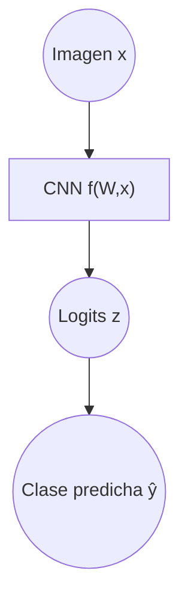
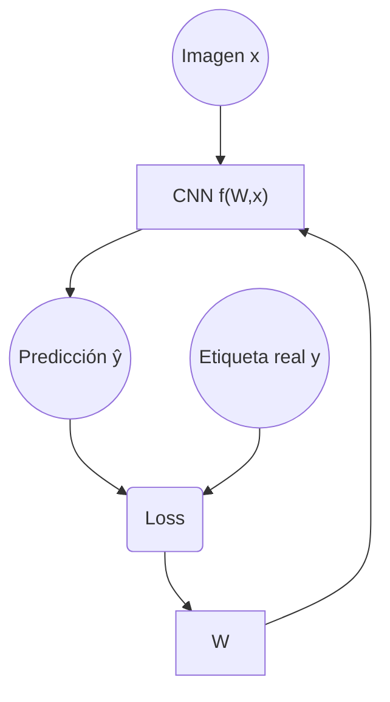
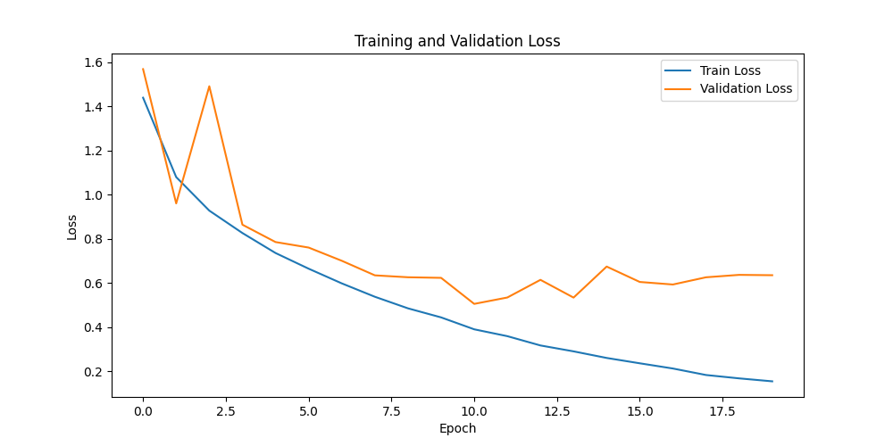
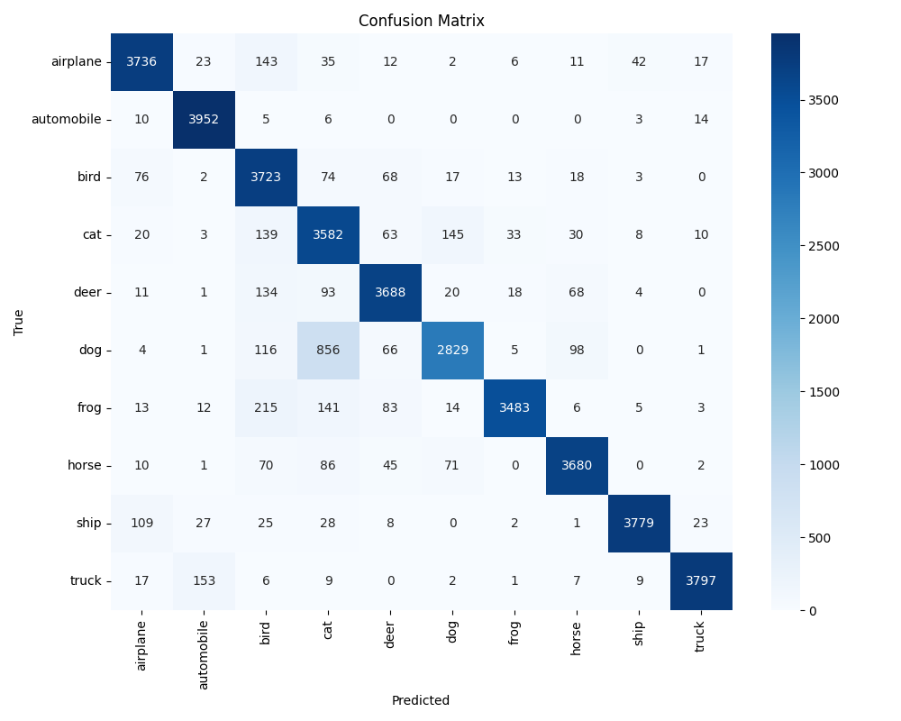
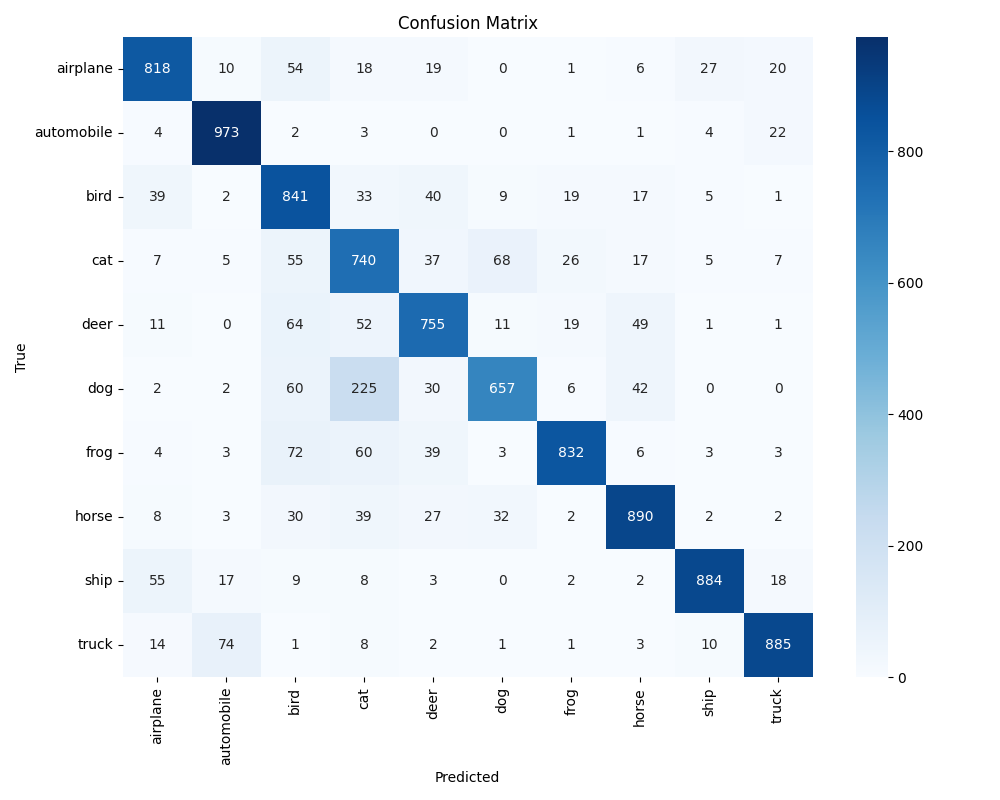
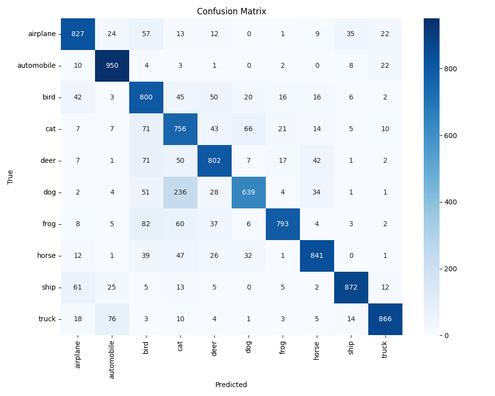
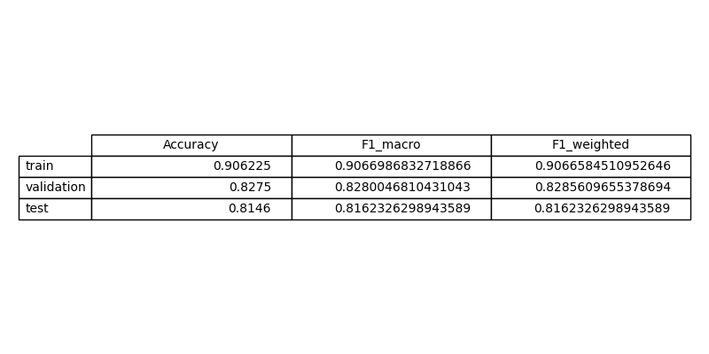

# Exercise 4: Create a Deep Learning Model for image classification in PyTorch with CIFAR-10 dataset

## Objective

El objetivo de este ejercicio es desarrollar un modelo de Deep Learning basado en redes neuronales convolucionales (CNN) para clasificar imágenes del dataset CIFAR-10. Además, también se realiza una evaluación que calcula métricas de rendimiento y genera la matriz de confusión.

Se compara este modelo con el modelo del ejercicio anterior (modelo clásico sin convoluciones) y se analiza el efecto del uso de técnicas propias de Deep Learning y posibles estrategias de mejora como data augmentation.

## Task Formalization

El objetivo consiste en asignar correctamente una etiqueta discreta a cada imagen de entrada.

Las entradas del modelo son imágenes RGB de tamaño 32×32 píxeles, que pueden representarse como tensores tridimensionales.

Y la salida una etiqueta discreta perteneciente a una de las 10 clases, que son: airplane, automobile, bird, cat, deer, dog, frog, horse, ship and truck.

### Task Formalization (Inference)

Existe una función desconocida $f$ que relaciona una imagen de entrada $x$ con su etiqueta correspondiente $y$:

$$
y = f(x)
$$

El objetivo es construir un modelo de aprendizaje automático que aproxime dicha función a partir de los datos disponibles. El modelo aprende un conjunto de parámetros $W$ que permiten expresar la relación entre la entrada y la salida:

$$
y = f(W,x)
$$

En el caso de una red neuronal convolucional, esta función está compuesta por múltiples transformaciones no lineales (convoluciones, activaciones, pooling y capas lineales) que generan un vector de salida. La predicción final se obtiene seleccionando la clase con mayor valor en el vector de salida.

Desde el punto de vista gráfico, el proceso de inferencia puede representarse como:

### Task Formalization (Training)

Durante el entrenamiento, el modelo recibe pares de datos 
$(x,y)$ donde $x$ es una imagen y $y$ es su etiqueta real. A partir de la entrada $x$, el modelo produce una predicción $y$.Esta predicción se compara con la etiqueta real mediante una función de pérdida, en este caso la entropía cruzada. Esta pérdida se utiliza para actualizar los parámetros del modelo mediante backpropagation del error y optimización basada en gradiente descendente.

El proceso puede representarse gráficamente de la siguiente manera:

Durante el entrenamiento, los parámetros $W$ se actualizan iterativamente para reducir la discrepancia entre las predicciones del modelo y las etiquetas reales. Una vez finalizado el proceso, el modelo debería ser capaz de generalizar y clasificar correctamente imágenes no vistas previamente.

## Evaluation metrics

En este trabajo se utilizan varias métricas para evaluar el rendimiento del modelo de clasificación sobre el dataset CIFAR-10. Dado que se trata de un problema de clasificación multiclase con diez categorías, es necesario emplear métricas que midan tanto el rendimiento global como el comportamiento por clase.

Las métricas utilizadas son: Accuracy, F1-score (macro y weighted) y la matriz de confusión.

Accuracy: Mide la proporción de predicciones correctas sobre el total de muestras evaluadas. Se calcula como el número total de ejemplos correctamente clasificados dividido por el total de ejemplos.

F1-score: Combina precision y recall en una única métrica mediante la media armónica. Precision indica qué proporción de las predicciones positivas para una clase son realmente correctas y recall indica qué proporción de los ejemplos reales de una clase han sido correctamente identificados.

El F1-score macro es el promedio simple del F1-score calculado para cada clase y el el F1-score weighted es un promedio ponderado por el número de muestras de cada clase.

Matriz de confusión: Proporciona una representación detallada del comportamiento del modelo en cada clase. Se define como una matriz de num classes x num classes donde las filas representan las clases reales y las columnas las clases predichas. Los elementos de la diagonal principal corresponden a las clasificaciones correctas y los elementos fuera de la diagonal representan predicciones erroneas.

## Data Considerations

### Dataset description

El dataset CIFAR-10 contiene: 60.000 imágenes, 10 clases balanceadas. Del cual 50.000 son de train y 10.000 de test.

Son imágenes de resolución 32×32 RGB.

Las clases incluyen objetos visualmente similares (cat/dog) y distintos (airplane/ship), lo que permite evaluar capacidad discriminativa

### Data preparation and preprocessing

Se convierte la imagen PIL en tensor y normaliza cada canal. Esto es importante para que el modelo aprenda de manera más eficiente, ya que las imágenescon valores de píxeles normalizados suelen converger más rápido durante el entrenamiento. Además, la normalización ayuda a evitar problemas de escala y mejora la estabilidad numérica del modelo.

Se divide el dataset en train test y evaluation. Se hace un split de las 50.000 imágenes de train para que 80% sean para train y el 20% sean para validation y se deja las 10.000 de test para el dataset de test, ya que CIFAR-10 ya tiene hecho ese split dentro.

### Data augmentation

No se implementa augmentation explícito. Podría añadirse: RandomHorizontalFlip, RandomCrop o RandomRotation, lo que aumentaría robustez y reduciría overfitting si da el caso.

## Model Considerations

La arquitectura sigue un patrón de bloques convolucionales parecido a VGG16:

Bloque 1: Conv(3 → 64), BatchNormalization, ReLU, Conv(64 → 64), BatchNormalization, ReLU, MaxPool (32 → 16)

Bloque 2: Conv(64 → 128), BatchNormalization, ReLU, Conv(128 → 128), BatchNormalization, ReLU, MaxPool (16 → 8)

Bloque 3: Conv(128 → 256), BatchNormalization, ReLU, MaxPool (8 → 4)

Global Average Pooling: AdaptiveAvgPool2d(1,1) que Reduce 256×4×4 → 256×1×1

Clasificador: Linear(256 → 128), ReLU, Dropout(0.5), Linear(128 → 10)

### Suitable Loss Functions

### Selected Loss Function

Se ha utilizado la función de pérdidda de entropía cruzada. Esta función es adecuada porque está diseñada específicamente para problemas de clasificación multiclase.

### Possible architectures

La arquitectura que se ha utilizado para el modelo de clasificación es la que se ha descrito en el apartado de model considerations. Es una arquitectura parecida al VGG16.

El modelo desarrollado utiliza tres bloques convolucionales con incremento progresivo de filtros (64 → 128 → 256), seguidos de Global Average Pooling y un clasificador totalmente conectado. Esta estructura permite capturar características jerárquicas sin introducir un número excesivo de parámetros.

### Last layer activation

La última capa del modelo es una capa lineal que produce un vector de dimensión igual al número de clases. No se aplica una función Softmax explícitamente en la arquitectura. Esto es porque CrossEntropyLoss aplica internamente una operación LogSoftmax antes de calcular la pérdida.

### Other Considerations

## Training

El entrenamiento se llevó a cabo utilizando el optimizador Adam, que adapta dinámicamente la tasa de aprendizaje para cada parámetro. Durante cada época, el modelo realiza un recorrido completo por el conjunto de entrenamiento, calculando la pérdida mediante crossentropyloss y actualizando los pesos mediante backpropagation. Tras cada época, se evalúa el rendimiento sobre el conjunto de validación para monitorizar la capacidad de generalización.

Se guarda el modelo con mejor rendimiento en validación, lo que evita seleccionar una versión sobreajustada.

### Training hyperparameters

Los hiperparámetros utilizados son:

Número de épocas: 10

Batch size: 64

Learning rate: 0.001

Optimizador: Adam

Dropout: 0.5

División entrenamiento-validación: 80/20

El learning rate controla el tamaño de los pasos de actualización de los pesos. Un valor demasiado alto puede generar inestabilidad, mientras que uno demasiado bajo ralentiza la convergencia. El valor seleccionado permite una convergencia progresiva y estable.

### Loss function graph

### Discussion of the training process

En el gráfico se observa que al principio tanto el training loss como el validation loss disminuyen, lo que indica que el modelo está aprendiendo correctamente. Sin embargo, a partir de aproximadamente la época 10, el training loss sigue bajando de forma continua mientras que el validation loss deja de mejorar e incluso empieza a oscilar ligeramente.

Esto es sobreajuste: el modelo continúa ajustándose cada vez mejor a los datos de entrenamiento, pero ya no mejora (e incluso empeora ligeramente) en datos no vistos.

El mejor modelo se encuentra aproximadamente en la época 10, que es donde el validation loss alcanza su valor mínimo antes de empezar a estabilizarse o subir. Y es este modelo el que se usa para el test porque tenemos puesto en el código del entrenamiento save the best model según la validación.

## Evaluation

### Evaluation metrics

La evaluación se realizó utilizando Accuracy, F1-score (macro y weighted) y matrices de confusión.

La matriz de confusión permite analizar detalladamente los errores entre clases específicas.

Matriz de confusión de entrenamiento:

Matriz de confusión de validación:

Matriz de confusión de test:

### Evaluation results

Aquí se muestran ejemplos de resultados de evaluación para los conjuntos de entrenamiento, validación y prueba.

Se muestran las métricas de cada conjunto de datos:

Los resultados muestran un rendimiento elevado tanto en entrenamiento como en validación y test. Las matrices de confusión presentan una concentración dominante en la diagonal principal, lo que indica que la mayoría de las predicciones son correctas.

Se observan algunas confusiones entre clases visualmente similares, lo cual es esperable dada la complejidad del dataset.

### Discussion of the results

How the model solves the problem?

El modelo resuelve el problema extrayendo características jerárquicas mediante capas convolucionales. Las primeras capas detectan bordes y texturas básicas, mientras que las capas más profundas combinan estas características en representaciones más abstractas.

Is there overfitting, underfitting or any other issues? 

No se observan síntomas claros de underfitting. Si la diferencia entre entrenamiento y test es pequeña, tampoco se evidencia overfitting significativo.

How can we improve the model?

Para mejorar el modelo podrían aplicarse técnicas como data augmentation, scheduler de learning rate o arquitecturas residuales.

How this model will generalize to new data?

En cuanto a generalización, el modelo debería funcionar adecuadamente en datos con distribución similar a CIFAR-10. Sin embargo, podría degradarse ante cambios significativos en iluminación, escala o contexto.

## Design Feedback loops

Para mejorar el modelo se siguió un proceso iterativo, introduciendo cambios progresivos en la arquitectura y analizando cómo afectaban a las métricas de entrenamiento, validación y test. Después de cada modificación, el modelo se volvía a entrenar y se comparaban los resultados para comprobar si realmente había una mejora.

En una primera fase se partió de una CNN básica con varios bloques de convolución y capas de MaxPooling, basandome en la arquitectura de VGG16. El modelo daba resultados aceptables, pero todavía se podia mejorar.

Por lo que, se añadieron más capas de convolución y se aumentó el número de filtros en las capas más profundas. Esto permitió mejorar la accuracy en entrenamiento, aunque también incrementó ligeramente el riesgo de sobreajuste.

Para estabilizar el entrenamiento y mejorar la generalización, se añadió Batch Normalization después de las capas convolucionales. Esto ayudó a que el proceso de aprendizaje fuera más estable y redujo la diferencia entre las métricas de entrenamiento y validación.

Por úlyimo, se añadió una capa nn.AdaptiveAvgPool2d al final del bloque convolucional. Esta capa reduce cada mapa de características a un único valor antes de la clasificación, lo que disminuye el número de parámetros y ayuda a controlar el sobreajuste. Con esto daba unas métricas mejores que al principio, por lo que este es el modelo final.

## Questions

### Which are the differences you found between previous model and this one?

Este modelo utiliza redes neuronales convolucionales (CNN) en lugar de multilayer perceptrons (MLP), lo que le permite aprovechar la estructura espacial de las imágenes. Mientras que en un MLP la imagen se aplana en un vector, perdiendo la información local entre píxeles vecinos, en una CNN se mantienen las dimensiones espaciales y se aplican filtros que detectan patrones como bordes, texturas y formas. 

El modelo convolucional es más adecuado para datos de tipo imagen, más eficiente computacionalmente y con mejor capacidad de generalización que el modelo anterior basado en perceptrones multicapa.

### Does the model generalizes well to new data?

Si las métricas de validación y test son similares y no existe una brecha significativa respecto al entrenamiento, el modelo demuestra buena capacidad de generalización.

La incorporación de regularización estructural (GAP y Dropout) favorece esta propiedad. No obstante, la ausencia de data augmentation podría limitar su robustez frente a transformaciones no vistas durante entrenamiento.