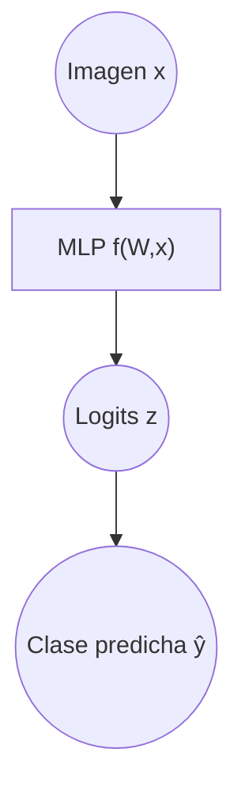
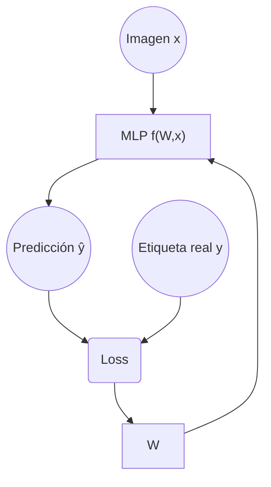
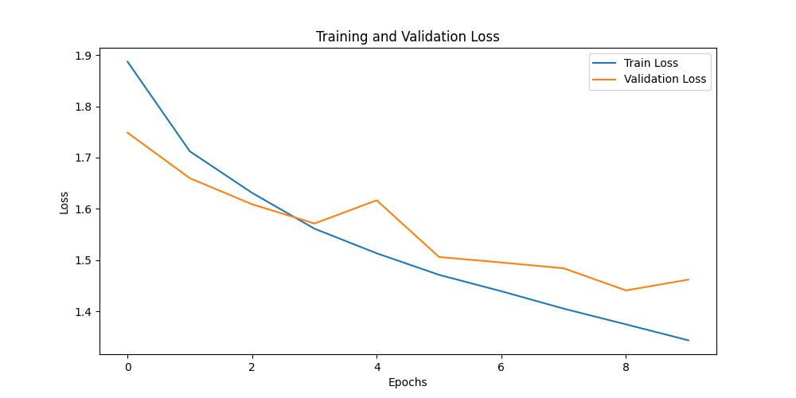
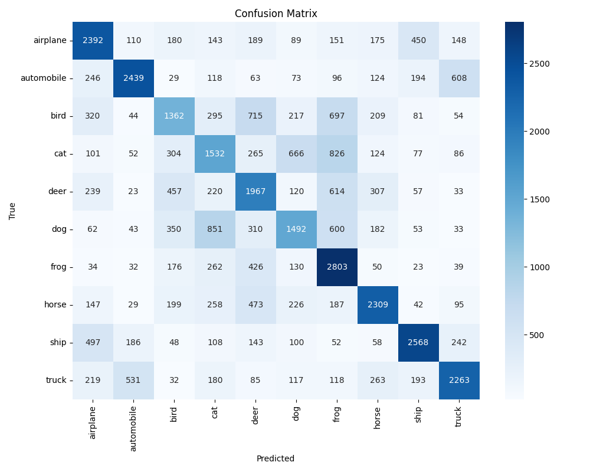
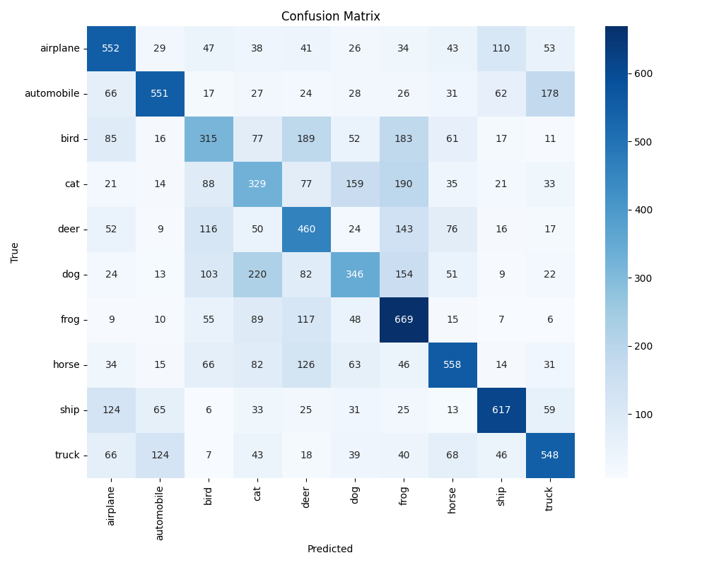
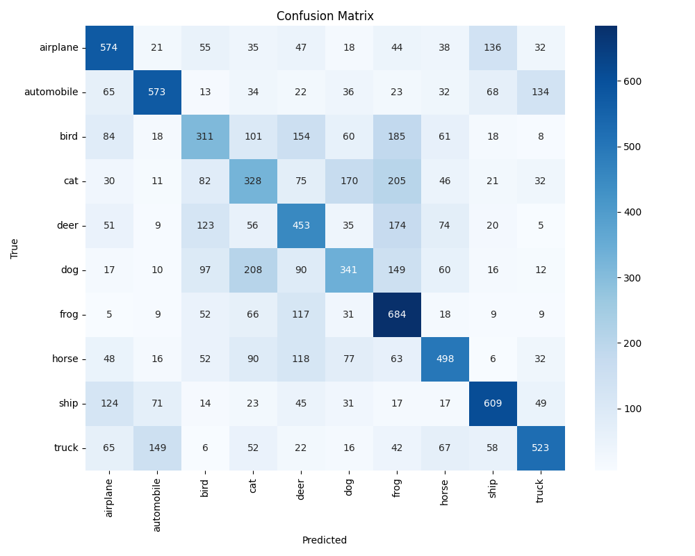
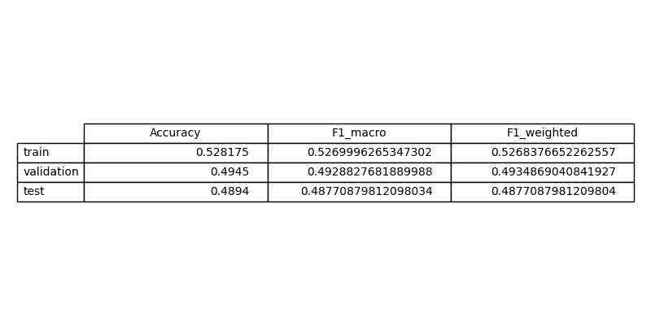

# Exercise 5: Create a Deep Learning Model for image classification in PyTorch with CIFAR-10 dataset

## Objective

El objetivo de este ejercicio es desarrollar un modelo de clasificación de imágenes usando unicamente capas fully connected. Más concretamente, se clasificarán imágenes del dataset CIFAR-10. Además, también se realizará una evaluación que calculará métricas de rendimiento y generará la matriz de confusión.

Finalmente, se analizará el rendimiento de esta red neuronal en comparación con la utilizada en  el ejercicio anterior, una red neuronal convolucional (CNN), más habitual para clasificación de imágenes

## Task Formalization

El objetivo consiste en asignar correctamente una etiqueta discreta a cada imagen de entrada.

Las entradas del modelo son imágenes RGB de tamaño 32×32 píxeles, que pueden representarse como tensores tridimensionales.

Y la salida una etiqueta discreta perteneciente a una de las 10 clases, que son: airplane, automobile, bird, cat, deer, dog, frog, horse, ship and truck.

### Task Formalization (Inference)

Existe una función desconocida $f$ que relaciona una imagen de entrada $x$ con su etiqueta correspondiente $y$:

$$
y = f(x)
$$

El objetivo es construir un modelo de aprendizaje automático que aproxime dicha función a partir de los datos disponibles. El modelo aprende un conjunto de parámetros $W$ que permiten expresar la relación entre la entrada y la salida:

$$
y = f(W,x)
$$

En el caso de esta red neuronal, esta función está compuesta por múltiples transformaciones no lineales que generan un vector de salida. La predicción final se obtiene seleccionando la clase con mayor valor en el vector de salida.

Desde el punto de vista gráfico, el proceso de inferencia puede representarse como:

### Task Formalization (Training)

Durante el entrenamiento, el modelo recibe pares de datos 
$(x,y)$ donde $x$ es una imagen y $y$ es su etiqueta real. A partir de la entrada $x$, el modelo produce una predicción $y$.Esta predicción se compara con la etiqueta real mediante una función de pérdida, en este caso la entropía cruzada. Esta pérdida se utiliza para actualizar los parámetros del modelo mediante backpropagation del error y optimización basada en gradiente descendente.

El proceso puede representarse gráficamente de la siguiente manera:

Durante el entrenamiento, los parámetros W se actualizan iterativamente para reducir la discrepancia entre las predicciones del modelo y las etiquetas reales. Una vez finalizado el proceso, el modelo debería ser capaz de generalizar y clasificar correctamente imágenes no vistas previamente.

## Evaluation metrics

En este trabajo se utilizan varias métricas para evaluar el rendimiento del modelo de clasificación sobre el dataset CIFAR-10. Dado que se trata de un problema de clasificación multiclase con diez categorías, es necesario emplear métricas que midan tanto el rendimiento global como el comportamiento por clase.

Las métricas utilizadas son: Accuracy, F1-score (macro y weighted) y la matriz de confusión.

Accuracy: Mide la proporción de predicciones correctas sobre el total de muestras evaluadas. Se calcula como el número total de ejemplos correctamente clasificados dividido por el total de ejemplos.

F1-score: Combina precision y recall en una única métrica mediante la media armónica. Precision indica qué proporción de las predicciones positivas para una clase son realmente correctas y recall indica qué proporción de los ejemplos reales de una clase han sido correctamente identificados.

El F1-score macro es el promedio simple del F1-score calculado para cada clase y el el F1-score weighted es un promedio ponderado por el número de muestras de cada clase.

Matriz de confusión: Proporciona una representación detallada del comportamiento del modelo en cada clase. Se define como una matriz de num classes x num classes donde las filas representan las clases reales y las columnas las clases predichas. Los elementos de la diagonal principal corresponden a las clasificaciones correctas y los elementos fuera de la diagonal representan predicciones erroneas.

## Data Considerations

### Dataset description

El dataset CIFAR-10 contiene: 60.000 imágenes, 10 clases balanceadas. Del cual 50.000 son de train y 10.000 de test.

Son imágenes de resolución 32×32 RGB.

Las clases incluyen objetos visualmente similares (cat/dog) y distintos (airplane/ship), lo que permite evaluar capacidad discriminativa

### Data preparation and preprocessing

Se convierte la imagen PIL en tensor y se normaliza cada canal. Esto es importante para que el modelo aprenda de manera más eficiente, ya que las imágenescon valores de píxeles normalizados suelen converger más rápido durante el entrenamiento. Además, la normalización ayuda a evitar problemas de escala y mejora la estabilidad numérica del modelo.

Se divide el dataset en train test y evaluation. Se hace un split de las 50.000 imágenes de train para que 80% sean para train y el 20% sean para validation y se deja las 10.000 de test para el dataset de test, ya que CIFAR-10 ya tiene hecho ese split dentro.

### Data augmentation

No se implementa data augmentation explícito. Podría añadirse: RandomHorizontalFlip, RandomCrop o RandomRotation, lo que aumentaría robustez y reduciría overfitting si da el caso.

## Model Considerations

El modelo utilizado es una red neuronal totalmente conectada (Multi-Layer Perceptron, MLP). Dado que el ejercicio restringe el uso a capas fully connected, no se han utilizado capas convolucionales ni mecanismos explícitos de extracción de características espaciales.

Las imágenes de entrada, originalmente de tamaño 3×32×32, se aplanan en un vector unidimensional de 3072 características. Este vector se introduce en una secuencia de capas lineales con funciones de activación no lineales, permitiendo al modelo aprender representaciones progresivamente más abstractas de los datos.

El modelo presenta una capacidad suficiente para aprender patrones del conjunto de entrenamiento, pero limitada para capturar relaciones complejas de las imágenes.

### Suitable Loss Functions

### Selected Loss Function

Se ha utilizado la función de perdida de entropía cruzada, la habitual para clasificación multiclase.

Esta función penaliza con mayor intensidad las predicciones incorrectas con alta confianza, lo que favorece una separación clara entre clases durante el entrenamiento.

### Possible architectures

Dentro de este ejercicio se podrían considerar varias arquitecturas fully connected, como una MLP poco profundo con una o dos capas ocultas, una MLP más profundo con varias capas y reducción progresiva de dimensionalidad, o una MLP con regularización adicional mediante Dropout o Batch Normalization.

La arquitectura seleccionada consta de varias capas densas con tamaños decrecientes, lo que permite una reducción gradual de dimensionalidad y un compromiso entre capacidad del modelo y coste computacional.

### Last layer activation

La última capa del modelo no utiliza ninguna función de activación. Esto es intencionado, ya que CrossEntropyLoss aplica internamente una operación LogSoftmax antes de calcular la pérdida.

### Other Considerations

Al tratarse de un MLP, el modelo no resulta eficiente del todo con imágenes, lo que limita su capacidad de generalización. Además, el número de parámetros crece rápidamente al trabajar directamente con píxeles, lo que incrementa el riesgo de sobreajuste.

Este diseño, sin embargo, resulta adecuado para mostrar las limitaciones de las redes fully connected en tareas de visión por computador y para compararlo con modelos convolucionales.

## Training

El entrenamiento se realiza mediante optimización basada en gradiente descendente utilizando el algoritmo Adam. El dataset de entrenamiento se divide en conjuntos de entrenamiento y validación, permitiendo monitorizar el rendimiento del modelo durante el aprendizaje y detectar posibles problemas de sobreajuste.

Se guarda el modelo que obtiene la menor pérdida de validación, asegurando que la versión final seleccionada generaliza mejor dentro de los datos disponibles.

### Training hyperparameters

Los hiperparámetros que se han utilizado son los siguientes:

- Optimizador: Adam
- Learning rate: 0.001
- Batch size: 64
- Número de épocas: 10
- Función de pérdida: CrossEntropyLoss
- División de datos: 80% train, 20% validation

### Loss function graph

### Discussion of the training process

Durante las primeras épocas, tanto la pérdida de entrenamiento como la de validación disminuyen de forma consistente, indicando que el modelo aprende patrones relevantes del dataset. Sin embargo, a partir de cierto punto (época 10 aproximadamente), la pérdida de validación comienza a aumentar mientras la de entrenamiento sigue disminuyendo.

Este comportamiento indica la aparición de overfitting, lo cual es esperable en un MLP aplicado directamente a imágenes sin regularización explícita ni inductive bias espacial. El modelo comienza a memorizar el conjunto de entrenamiento en lugar de aprender patrones generalizables.

## Evaluation

### Evaluation metrics

La evaluación se realizó utilizando Accuracy, F1-score (macro y weighted) y matrices de confusión.Estas métricas permiten analizar tanto el rendimiento global como el comportamiento específico por clase, identificando posibles confusiones entre categorías visualmente similares.

Matriz de confusión de entrenamiento:

Matriz de confusión de validación:

Matriz de confusión de test:

### Evaluation results

Aquí se muestran ejemplos de resultados de evaluación para los conjuntos de entrenamiento, validación y prueba.

Se muestran las métricas de cada conjunto de datos:

### Discussion of the results

El modelo es capaz de aprender características básicas del dataset, logrando una precisión razonable considerando que se utiliza una MLP y no una CNN. Sin embargo, se observan confusiones frecuentes entre clases visualmente similares, como cat y dog o truck y automobile, además de conseguir una métricas no muy buenas donde el accuracy está alrededor del 50%.

A partir de la época 10 existe un claro sobreajuste, que se debe principalmente a la incapacidad del MLP para capturar relaciones espaciales locales presentes en las imágenes.

El modelo generaliza de forma limitada a datos no vistos. Para mejorar el rendimiento sería necesario utilizar arquitecturas convolucionales.

## Design Feedback loops

Para el desarrollo de este modelo se tomó como punto de partida la arquitectura MLP utilizada en el ejercicio 3. Dado que en este caso se trata de un problema de clasificación, más complejo que el de regresión, fue necesario aumentar la capacidad del modelo añadiendo una capa adicional, permitiendo así un aprendizaje más adecuado de los datos.

Además, el número de neuronas se reduce progresivamente a lo largo de las capas con el objetivo de que el modelo vaya simplificando la información de entrada. En las primeras capas se trabaja con una gran cantidad de datos, ya que las imágenes contienen muchos píxeles y detalles. A medida que la información avanza por la red, las capas posteriores se centran en combinar y resumir dicha información, buscando patrones más relevantes y quedándose únicamente con aquellos aspectos esenciales para realizar la clasificación final.

Por otro lado, en un primer intento, el modelo se entrenó durante 25 épocas. Aunque la pérdida de entrenamiento disminuía de forma constante, se observó que la pérdida de validación comenzaba a aumentar a partir de cierto punto, indicando la aparición de sobreajuste. Para solucionar este problema, se redujo el número de épocas a 10 de forma que el modelo dejó de sobreentrenarse, manteniendo un rendimiento más estable en el conjunto de validación, pero sin conseguir alcanzar valores demasiado bajos de loss,

## Questions

### Which are the differences you found between previous model and this one?

La principal diferencia entre este modelo y el utilizado en el ejercicio anterior (CNN) es la capacidad de explotar la estructura espacial de las imágenes. Mientras que la CNN utiliza filtros convolucionales para capturar patrones locales y jerárquicos, el MLP trata cada píxel de forma independiente.

Esto se traduce en un rendimiento significativamente inferior del MLP, especialmente en términos de generalización y robustez frente a variaciones visuales.

### Does the model generalizes well to new data?

El modelo presenta una capacidad de generalización bastante limitada. Aunque logra clasificar correctamente una proporción significativa de imágenes no vistas, su rendimiento es claramente inferior al de modelos convolucionales. Esto confirma que, para tareas de clasificación de imágenes, las arquitecturas fully connected no son la opción más adecuada.

